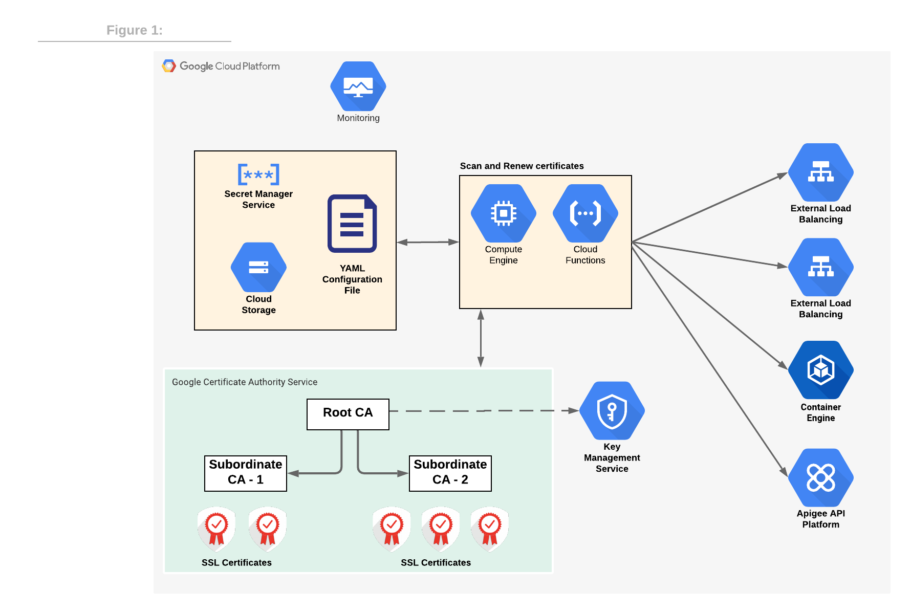

# GCP-CA-Service-Helper-Scripts
 
This repository includes helper scripts for the Google Cloud Certificate Authority Service. Currently the script supports GCP Load Balancer Auto-Renewal.
 
## System requirements
Currently, this GCP-CA-Service-Helper-Script uses both GCP Python3 SDK and the [gcloud command-line tool](https://cloud.google.com/sdk/gcloud). To install gcloud and Python3 SDK on a GCP Compute (VM) follow the installation instructions from [this link](https://cloud.google.com/sdk/install).
 
Note: the script cannot be executed as [Cloud Function](https://cloud.google.com/functions). In the next version of the script gcloud command will be replaced with Python3 and then the script can be deployed as Cloud Function.
 
## Installation
Clone the repository and run the next commands.
```sh
pip3 install -r requirements.txt
export CLOUDSDK_PYTHON_SITEPACKAGES=1;
 ```

## Usage:
 ```sh
 Cd GCP-Loadbalancer-helper
 python3 private_ca_renew_lb_in_project.py <project-id> <private-ca-subordinate-name>
 ```
 
 
## Renew Load-Balancers self-managed certifications in a project
### Overview:
This script rotates load balancers SSL certificates when the certificate's remaining cert-life is less than a threshold. For example, if the remaining cert-life threshold is set to  50%, then a 30 days cert will be renewed 15 days before expiration. If the remaining cert life threshold is set to 90%, then a 24hrs cert will be renewed 2.4hrs before certification expiration.
The script assumes all certificates are issued from a pre-configured subordinate CA named 'private-ca-subordinate-name'.
 
The script is designed to run as a [cron job ](https://www.hostgator.com/help/article/what-are-cron-jobs), the certificate(s) installed on the resources listed in the YAML configuration file will be queried for certificate life-span and renewed if needed. The frequency in which this script executes depends on the certificates' life-span, for example if the certification are issued for 24 hours and expected to be renewed 6 hours before expiration, then the script should be executed every 4 hours with the following crontab schedule expression: ```0 */4 * * *```. CGP [Cloud Schedule] (https://cloud.google.com/scheduler/docs/creating) is a service that can help in scheduling and managing cron-jobs.
 
 
## Architectural overview:
 

 
The YAML file binds between resources on the right (such as load balancer) and a subordinate CA. For example the following snippes bind a global load balancer called “demo-lb-target-proxy” with a subordinate CA “server-tls-2”.
The cert_renew_ratio indicates the portion of the certification validity time before renewal, for example 70 means that the certificate will be renewed after 70% of its life span (e.g.: if the certificate has been issued for 100 minutes, it will be renewed after 70 minutes).
 
```ssl_resources:
  "load-balancer":
    type: "GLB" #Global Load Balancer
    name: "demo-lb-target-proxy"
    subordinate-ca: "server-tls-2"
    subordinate-ca-region: "us-west1"
    cert_renew_ratio: 70
  "load-balancer-2":
    type: "ILB" # Internal Load Balancer
    name: "ilb-loadbalancer-target-proxy"
    subordinate-ca: "Joonix-Server-TLS-CA"
    subordinate-ca-region: "us-central1"
    cert_renew_ratio: 50
    region: "us-central1"
```
The YAML file configuration includes the follwing paramaters:
**type:**: GLB or ILB 

**name:** Load Balancer name

**subordinate-ca:** name of an exsisting subordinate CA

**subordinate-ca-region:** the region of the subordinate CA (can be diffrent than load-balancer)

**cert_renew_ratio:** The cert life-span % before auto-renewal

**region:** Load Balancer region (applicable to internal load balancer)


The example YAML file above lists two GCL load balancers, the external load balancer is denoted with type: "GLB" and the internal load balancer denoted with "ILB".
Each load balancer needs to be associated with a subordinate CA (name and region), in addition internal load-balancer needs to include it region, in the example load-balancer-2 is an internal load balancer in us-central1 and it subordinate CA is also in us-central-1.
The cert_renew_ratio indicates the lifespan of the certificate before the renewal process kicks in, the value is in percentage. In the example above, the GLC certificate will be renewed after 70% of the certificare life, whereas ILB certificate will be renewed at half-time.
 
 
It is recomended to store the YAML file in GCP Secret Manager or Cloud Storage with the right access controls.
 
 
## Auditing and Logging:
By default GCP Certificate Authority Service logs every operation performed in Cloud Logging, in addition alerts and notifications can be configured based on metrics. For example a notification can be delivered to Pub/Sub anytime Root CA configuration has changed. The script is designed to extend SSL-based resources certification automation and we are welcoming pull requests.


